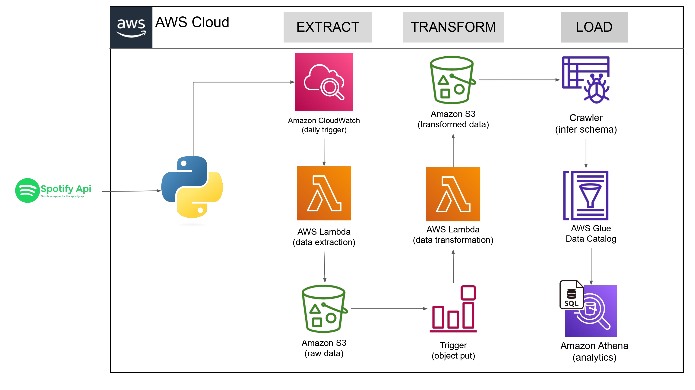

# Spotify ETL Pipeline

## Overview
This repository contains an ETL (Extract, Transform, Load) pipeline that extracts music data from the **Spotify API**, processes the raw JSON data, and stores the transformed data in an **AWS S3 bucket**. The processed data is organized into structured CSV files for further analysis.

## ETL Architecture Diagram
This is the architecture of the Spotify ETL pipeline:



## Project Structure
```
📂 Spotify_ETL
├── 📂 data/                   # Transformed data stored as CSV
│   ├── album_transformed_*.csv
│   ├── artist_transformed_*.csv
│   ├── songs_transformed_*.csv
│
├── 📂 raw_data/                # Raw JSON files from Spotify API
│   ├── to_processed/          # JSON files before transformation
│   ├── processed/             # JSON files after transformation
│
├── 📂 transformed_data/        # Final cleaned datasets
│   ├── album_data/
│   ├── artist_data/
│   ├── songs_data/
│
├── 📂 screenshots/             # S3 & Lambda configurations screenshots
│
├── Spotify_etl.ipynb          # Jupyter Notebook for ETL process
├── Spotify_etl.ipynb - Colab.pdf # PDF version of ETL Notebook
├── README.md                  # Project Documentation
```

## Data Flow
1. **Extract**: Fetch raw data from Spotify API using the `Spotipy` library.
2. **Transform**:
   - Convert raw JSON into structured **albums, artists, and songs** data.
   - Clean and preprocess data into Pandas DataFrames.
   - Convert DataFrames into CSV files.
3. **Load**:
   - Store transformed CSV files in an **AWS S3 bucket**.
   - Organize data into separate folders (`album_data/`, `artist_data/`, `songs_data/`).

## AWS S3 Setup
- The transformed data is uploaded to an **AWS S3 bucket**: `spotify-etl-de-bt`
- The **raw data** is stored in the `raw_data/to_processed/` folder before transformation.
- The **processed data** is stored in `transformed_data/` after cleaning and processing.

### **S3 Bucket Folder Structure**:
```
📂 spotify-etl-de-bt/
│── 📂 raw_data/
│   ├── to_processed/
│   ├── processed/
│
│── 📂 transformed_data/
│   ├── album_data/
│   ├── artist_data/
│   ├── songs_data/
```

## AWS Lambda Trigger
- **Trigger Source**: S3 event trigger on `raw_data/to_processed/*.json`
- **Event Type**: `All object create events`
- **Lambda Function**: Processes JSON files, transforms data, and stores structured output in S3

## Required Libraries
To run this ETL pipeline, install the following dependencies:
```sh
pip install spotipy pandas boto3
```

## Running the ETL Pipeline
1. **Clone the Repository**:
   ```sh
   git clone https://github.com/your-username/spotify-etl.git
   cd spotify-etl
   ```
2. **Run the Jupyter Notebook**:
   - Open `Spotify_etl.ipynb`
   - Execute all cells to fetch, transform, and upload data to S3

## Screenshots
Included screenshots for reference:
- AWS Lambda trigger configuration
- S3 bucket structure
- JSON raw data and processed CSV files

## Contribution
Feel free to fork this repository and improve the pipeline!

## License
This project is licensed under the MIT License.

